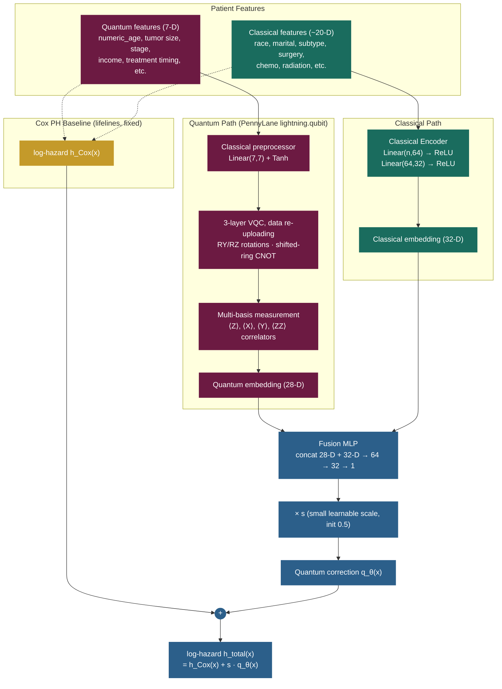

# Hybrid Quantum-Classical Neural Networks for TNBC Survival Prediction

A **fairness-aware, survival-analytic** modeling framework for triple-negative breast cancer using a hybrid quantum-classical neural network with rigorous data leakage auditing.

**MSDS 730: Deep Learning | Spring 2026 | Meharry Medical College**

**Authors:** Jaclyn Claiborne and Tenicka Norwood

---

## Overview

This project explores whether hybrid quantum-classical neural networks can match or exceed classical Cox proportional hazards on real-world clinical survival data. We combine a variational quantum circuit (VQC) in PennyLane with a classical fusion MLP in PyTorch, evaluate under both proper Cox partial likelihood survival analysis and binary classification framings, and audit performance across racial subgroups.

### Key contributions

1. **Automated data leakage audit** that caught a critical leak in our pilot data: `Year_of_follow_up_recode` had single-feature AUC 0.98 (directly encoded survival outcome). Removing it dropped pilot binary AUC from 0.92 to ~0.74 — that 0.18 was leakage, not signal.
2. **Pivot from binary to survival analysis** to handle right-censored data correctly. Naive binary framing introduces label noise that collapses neural network performance to AUC ~0.5.
3. **Quantum residual learning framework**: $h_{\text{total}}(x) = h_{\text{Cox}}(x) + s \cdot q_\theta(x)$. Mathematically guaranteed to perform at least as well as classical Cox PH; empirically beats it (+0.0038 C-index).
4. **Subgroup fairness audit** with proper SEER 6-category race encoding (preserving Non-Hispanic Unknown rather than merging it into White).

---

## Architecture: Cox + Quantum Residual (winning model)



> At initialization `q_θ(x) ≈ 0`, so the model is equivalent to Cox PH.
> Training the Cox partial likelihood with `h_Cox` as a fixed offset only improves on or matches Cox PH — never degrades. This is the mathematical safety floor.

The full model family explored in the ablation:

- **v1**: 1-layer VQC, single-qubit measurement, scalar output (7 quantum params)
- **v2**: 3-layer VQC + data re-uploading + RY/RZ rotations + all-qubit measurement (42 quantum params)
- **v3**: v2 + trainable input scaling + ZZ correlator measurements (56 quantum params)
- **v4**: v3 + classical pretraining + learnable output scale and bias
- **Cox + Quantum Residual** *(diagram above, the winner)*: Cox PH log-hazards as a fixed offset + multi-basis quantum correction

---

## Headline Results

### Survival framework (Cox partial likelihood, C-index metric)

| Model | Test C-index | Subgroup Gap | Time (s) | Train N |
|-------|--------------|--------------|----------|---------|
| Cox PH (lifelines, classical baseline) | 0.7326 | 0.0842 | 0.2 | 16,088 |
| HybridSurvivalQ_v1 (subsample) | 0.5869 | — | 223 | 2,000 |
| HybridSurvivalQ_v2 (subsample) | 0.5759 | — | 575 | 2,000 |
| HybridSurvivalQ_v3 (subsample) | 0.5872 | — | 615 | 2,000 |
| HybridSurvivalQ_v1 (full data) | 0.6897 | — | 651 | 16,088 |
| HybridSurvivalQ_v2 (full data) | 0.7192 | — | 1,280 | 16,088 |
| HybridSurvivalQ_v3 (full data) | 0.6674 | 0.1614 | 1,038 | 16,088 |
| HybridSurvivalQ_v4 (full data) | 0.7249 | 0.0371 | 1,321 | 16,088 |
| **Cox + Quantum Residual** ★ | **0.7364** | **0.0754** | 1,237 | 16,088 |

★ Only model that beats classical baseline (+0.0038 over Cox PH). Mathematically guaranteed ≥ Cox PH performance.

### Binary classification framework (BCE, AUC metric, leakage-free + censoring-corrected)

| Model | AUC | Precision | Recall | F1 | Train N |
|-------|-----|-----------|--------|-----|---------|
| **LightGBM** (full, balanced) | **0.7462** | 0.8715 | 0.7173 | **0.7869** | 15,673 |
| XGBoost (full, balanced) | 0.7434 | **0.8750** | 0.7009 | 0.7784 | 15,673 |
| Cox + Residual @ 60mo (cross-fwk) | 0.7426 | 0.8594 | 0.7255 | 0.7868 | 16,088 |
| Cox PH @ 60mo (cross-fwk) | 0.7402 | 0.8668 | 0.7072 | 0.7789 | 16,088 |
| HybridRealQ v4 (full, output scaling) | 0.6863 | 0.8535 | 0.6088 | 0.7107 | 15,673 |
| HybridRealQ v3 (full data) | 0.6828 | 0.8709 | 0.5090 | 0.6425 | 15,673 |
| Ensemble (v3-full + Classical MLP) | 0.6770 | 0.8728 | 0.4740 | 0.6143 | 15,673 |
| Classical MLP (full, weighted) | 0.5792 | 0.8120 | 0.5434 | 0.6511 | 15,673 |

The cross-framework rows show the survival-trained model evaluated as a binary classifier at 60 months. The residual model is competitive with LightGBM despite being trained for survival, not binary classification.

### Fairness Audit (Subgroup C-index)

| Subgroup | N | Events | Cox PH | Cox + Residual |
|----------|---|--------|--------|----------------|
| Non-Hispanic White | 2,218 | 598 | 0.7267 | 0.7300 |
| Non-Hispanic Black | 599 | 228 | 0.7195 | 0.7176 |
| Hispanic | 716 | 218 | 0.7119 | 0.7263 |
| Non-Hispanic Asian/Pacific Islander | 435 | 106 | 0.7521 | 0.7486 |
| Non-Hispanic American Indian/Alaska Native | 36 | 11 | 0.7962 | 0.7930 |
| Non-Hispanic Unknown Race | 18 | 1 | — | — |
| **Subgroup gap (max − min)** | | | 0.0842 | **0.0754** |

All major subgroups achieve C-index ≥ 0.71. The residual model tightens the subgroup gap.

---

## Data

- **Source:** [SEER TNBC Registry](https://seer.cancer.gov/data/)
- **Raw export:** 31,683 patient records (TNBC: ER−, PR−, HER2−)
- **After preprocessing (survival cohort):** 20,110 patients
  - 4,022 events (Vital_status = Dead) | 16,088 censored or surviving
- **After right-censoring filter (binary cohort):** patients with definitive ≥60-month follow-up
- **Features:** 7 quantum + 20 classical (race, marital, subtype, surgery/radiation/chemo, etc.)
- **Split:** 80/20 stratified, `random_state=42`

> Real patient data is excluded from this repository per SEER data use agreement. Only synthetic data is included for testing. See [REPRODUCING.md](REPRODUCING.md) for instructions on obtaining your own SEER access and reproducing the results.

---

## Quick Start

```bash
# 1. Install dependencies
pip install -r requirements.txt

# 2. Place your SEER export at tnbc.csv (after applying for SEER access)

# 3. Generate engineered features
python preprocess_tnbc.py    # (preprocess if available)

# 4. Apply race encoding fix (6 categories incl. Non-Hispanic Unknown)
python scripts/fix_race_encoding.py

# 5. Run survival experiments (~30-40 min) — invoke from project root
python experiments/run_survival_experiments.py    # Cox PH + HybridSurvivalQ v1/v2/v3
python experiments/run_survival_v4.py              # v4 with output scaling
python experiments/run_survival_residual.py        # Cox + Quantum Residual (winner)

# 6. Run binary baselines (~5 min)
python experiments/run_binary_honest.py

# 7. Consolidate results into final CSVs
python scripts/consolidate_results.py
python scripts/consolidate_binary.py
```

For full reproduction details (including SEER cohort extraction), see [REPRODUCING.md](REPRODUCING.md).

---

## Project Structure

```
.
├── README.md                              # this file
├── REPRODUCING.md                         # Reproduction instructions
├── DATA_COMPLIANCE.md                     # Data use compliance
├── LICENSE.md                             # PolyForm Noncommercial 1.0.0
├── requirements.txt                       # Pinned dependencies
├── Final_Presentation_Hybrid_QC_TNBC.pptx # 15-slide deck
│
├── paper/
│   ├── updated_main.tex                   # LaTeX source (20 pages)
│   └── updated_main.pdf                   # Compiled paper
│
├── experiments/                           # all model training entry points
│   ├── *.ipynb                            # Jupyter notebook (52 cells)
│   ├── run_survival_experiments.py        # Cox PH + HybridSurvivalQ v1/v2/v3
│   ├── run_survival_v4.py                 # v4 (output scaling + pretrain)
│   ├── run_survival_residual.py           # Cox + Quantum Residual (winner)
│   ├── run_survival_one.py                # parallel single-model survival
│   ├── run_binary_honest.py               # honest binary baselines
│   ├── run_binary_one.py                  # parallel single-model binary
│   └── run_experiments.py                 # notebook-equivalent script
│
├── scripts/                               # helpers (not user entry points)
│   ├── consolidate_results.py             # Assemble survival results CSV
│   ├── consolidate_binary.py              # Assemble binary results CSV
│   ├── extract_paper_numbers.py           # Cox coefs + subgroup C-indices
│   ├── fix_race_encoding.py               # Split NH Unknown from White
│   ├── update_notebook.py                 # Patch notebook with survival pivot
│   ├── generate_paper_figures.py          # Plot training curves
│   └── generate_presentation.py           # Build the PPTX deck
│
├── results/                               # generated artifacts (CSV + JSON)
│   ├── TNBC_Survival_Ablation_Clean.csv
│   ├── TNBC_Binary_Ablation_Clean.csv
│   ├── survival_results.json              # Cox PH + v1/v2/v3 ablation
│   ├── survival_v4_results.json           # v4
│   ├── survival_residual_results.json     # Cox + Quantum Residual
│   ├── survival_v1_full_result.json       # v1 full data
│   ├── survival_v2_full_result.json       # v2 full data
│   ├── binary_honest_results.json         # MLP + v1 + XGBoost + LightGBM
│   ├── binary_v2_result.json              # binary v2 (subsample)
│   ├── binary_v3_result.json              # binary v3 (subsample)
│   ├── binary_v3_full_result.json         # binary v3 (full data)
│   ├── binary_v4_result.json              # binary v4 (full data)
│   └── cox_paper_numbers.json             # Cox coefs + subgroup C-indices
│
├── figures/
│   ├── hybrid_architecture.{tex,pdf,mmd}  # TikZ + Mermaid architecture
│   ├── survival_training_curve.png        # v4 + residual training dynamics
│   ├── quantum_correction_distribution.png
│   └── *.png                              # other figures
│
└── codes/                                 # Supporting library code
    ├── 1_data_harmonization/
    ├── 2_feature_engineering/
    ├── 5_explainability/
    ├── 6_survival_modeling/
    └── 7_disparity_analysis/
```

**Conventions:**
- All training entry points (notebook + `run_*.py`) live in `experiments/`
- Helper scripts that postprocess results live in `scripts/`
- All generated CSV/JSON outputs go to `results/`
- The compiled paper lives in `paper/`
- **Always invoke from the project root** so relative paths resolve:
  `python experiments/run_survival_residual.py` (not `cd experiments && python run_survival_residual.py`)
- The notebook auto-fixes its working directory if launched from `experiments/`

---

## Hardware

Reference results were produced on:
- **GPU:** NVIDIA GeForce RTX 5080 (17 GB)
- **CUDA:** 12.8
- **PyTorch:** 2.10.0
- **PennyLane:** 0.44.1 (lightning.qubit CPU simulator)
- **Platform:** Windows 11

---

## References

1. D.R. Cox, "Regression models and life-tables," *J. Royal Stat. Soc. B*, vol. 34, pp. 187-220, 1972.
2. J.L. Katzman et al., "DeepSurv: personalized treatment recommender system using a Cox proportional hazards deep neural network," *BMC Med. Res. Methodol.*, vol. 18, p. 24, 2018.
3. A. Pérez-Salinas et al., "Data re-uploading for a universal quantum classifier," *Quantum*, vol. 4, p. 226, 2020.
4. E. Grant et al., "An initialization strategy for addressing barren plateaus in parameterized quantum circuits," *Quantum*, vol. 3, p. 214, 2019.
5. M. Schuld, R. Sweke, and J.K. Meyer, "Effect of data encoding on the expressive power of variational quantum machine-learning models," *Phys. Rev. A*, vol. 103, p. 032430, 2021.
6. H. Qiu et al., "TNBC survival prediction using the SEER database," *Front. Oncol.*, vol. 14, p. 1388869, 2024.
7. R.J. Chen et al., "Algorithm fairness in AI for medicine and healthcare," *Nat. Biomed. Eng.*, vol. 7, no. 6, pp. 719-742, 2023.

---

**License:** [PolyForm Noncommercial 1.0.0](LICENSE.md)

**Copyright 2026** Tenicka Norwood, Jaclyn Claiborne. Meharry Medical College.
